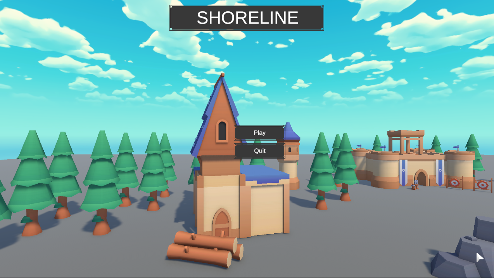
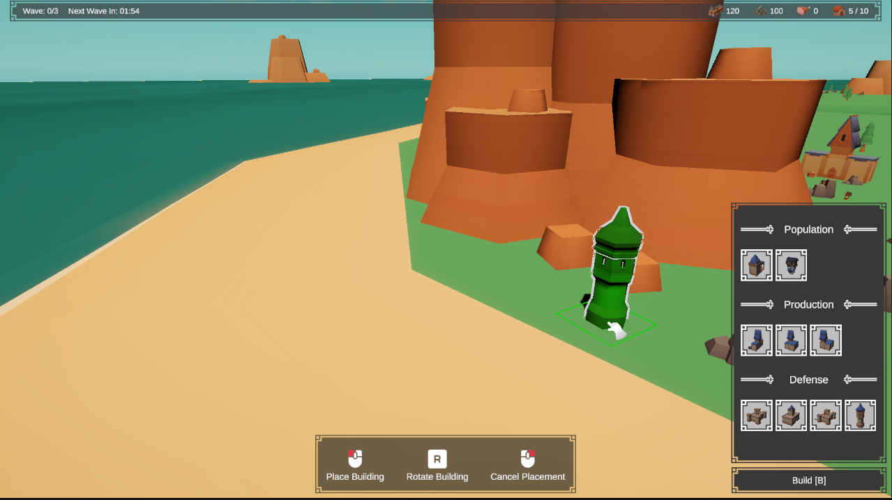
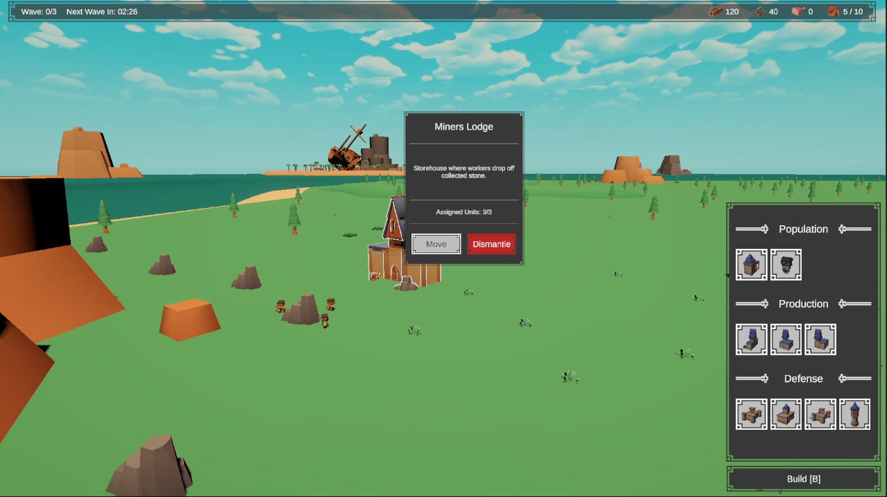

# GameOff2025 GameJam
Game Submission for GameOff2025 GameJam

## Team
* J. M. (DeterminedPanda)
    * Dev/Design/Artist
* Jan Schulz (BloggingWithJan)
    * Dev/Design

## Free Assets
All 3D Assets are from [Kenney](https://kenney.nl/)

## Licensed Assets
* None

## Itch.io page
[Shoreline](https://buggedbutplayable.itch.io/shoreline)

## Preview
Shoreline is a challenging Real-Time Strategy game where every defense structure and recruited unit matters. Your survival hinges on mastering resource management and strategic building placement as you defend your isolated island base against relentless, wave-based attacks.

